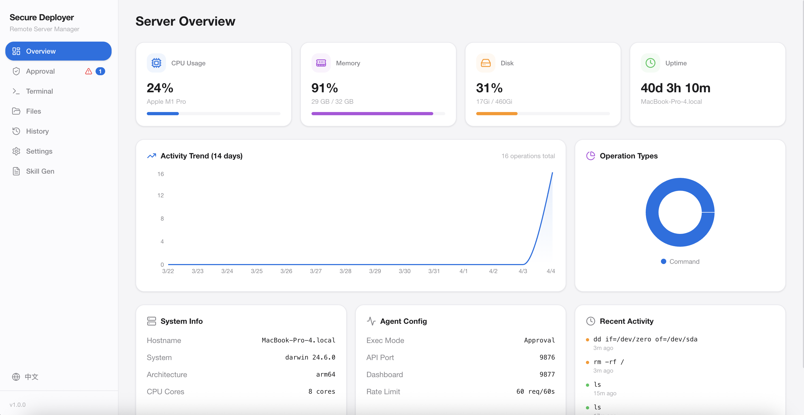
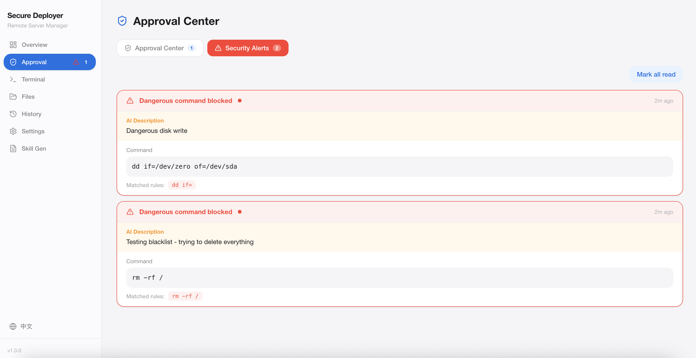
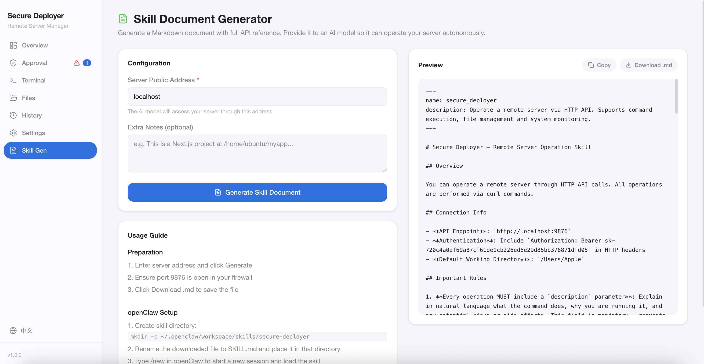
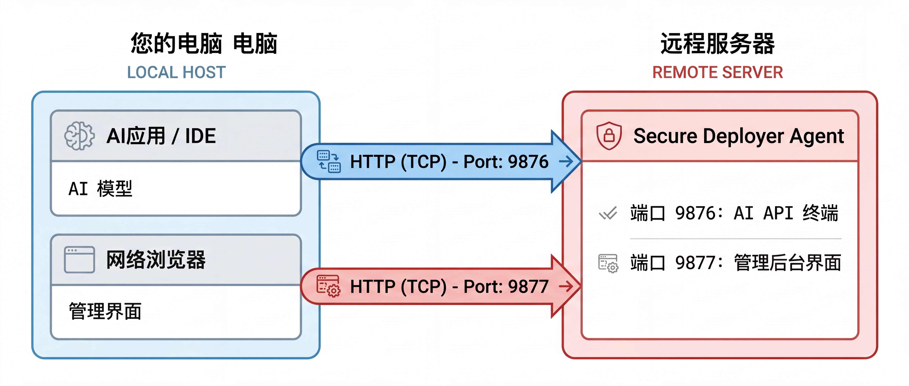

<div align="center">

# 🛡️ Secure Deployer

**让 AI 帮你管服务器 — 安全的远程命令执行与管理工具**

[English](./README_EN.md) | 简体中文

[](./LICENSE)
[](https://nodejs.org/)
[](https://react.dev/)
[](https://www.typescriptlang.org/)
[]()
[]()

</div>

---



## 这是什么？

Secure Deployer 在你的远程服务器上运行一个轻量 HTTP 服务，让 AI 应用（Cursor、openClaw等）通过 HTTP API 帮你执行命令、管理文件、部署项目。

**解决的痛点：**

- AI 应用拒绝处理服务器密码或 SSH 连接 → Secure Deployer 提供 HTTP API，AI 能自如调用
- VPN 导致 SSH 连接不稳定 → HTTP 短连接天然比 SSH 长连接更稳定
- 不放心 AI 在服务器上乱搞 → 默认审批模式，每条命令都要你批准才执行
- 非技术用户看不懂命令 → AI 提交命令时必须附带自然语言说明

## 核心特性

**🔒 安全第一**
- 默认审批模式：AI 的每条命令都需要你在管理界面手动批准
- AI 必须用自然语言说明每条命令的目的和风险
- 危险命令自动拦截 + 实时告警通知（可配置黑名单）
- 双端口隔离：AI API 和管理界面分开



**⚡ 功能完善**
- 命令执行（同步 + 流式输出）
- 文件管理（浏览、编辑、上传、下载）
- 系统监控（CPU / 内存 / 磁盘）
- 操作历史记录 + 可视化统计
- Skill 文档一键生成



**🌐 用户友好**
- Web 可视化管理界面
- 中英文双语支持
- 一键安装脚本
- 非技术用户也能轻松上手

## 快速开始

### 服务器上安装

```bash
# 一键安装（需要 root 权限）
curl -fsSL https://raw.githubusercontent.com/chasedai/secure-deployer/main/scripts/install.sh | sudo bash
```

或手动安装：

```bash
git clone https://github.com/chasedai/secure-deployer.git
cd secure-deployer
npm install
npm run build
npm start
```

### 使用步骤

1. **打开管理界面**：浏览器访问 `http://你的服务器IP:9877`，设置管理密码
2. **生成 Skill 文档**：进入「Skill 生成」页面，填入服务器地址，一键生成
3. **给 AI 应用**：将文档提供给你使用的 AI 应用（openClaw、Cursor、Claude 等）
4. **开始工作**：AI 根据文档自动调用 API，你在管理界面审批即可

## 架构



**双端口设计：**
- `9876`（AI API）：API Key 认证，供 AI 应用调用
- `9877`（Dashboard）：密码认证，供人类管理

## 两种执行模式

| | 审批模式（默认） | 直接执行模式 |
|---|---|---|
| 安全性 | AI 命令需手动批准 | 命令立即执行 |
| 适合 | 刚开始使用、不信任 AI 时 | 熟悉后、信任 AI 时 |
| 切换方式 | 管理界面 → 设置 | 管理界面 → 设置 |

## API 接口

所有 API 需要 Header: `Authorization: Bearer <API_KEY>`

| 接口 | 方法 | 说明 | 需要审批 |
|---|---|---|---|
| `/api/exec` | POST | 执行命令 | 是 |
| `/api/tasks/:id` | GET | 查询任务状态 | 否 |
| `/api/files/list` | GET | 列出目录 | 否 |
| `/api/files/read` | GET | 读取文件 | 否 |
| `/api/files/write` | POST | 写入文件 | 是 |
| `/api/files/delete` | DELETE | 删除文件 | 是 |
| `/api/files/upload` | POST | 上传文件 | 是 |
| `/api/files/download` | GET | 下载文件 | 否 |
| `/api/system` | GET | 系统信息 | 否 |
| `/api/health` | GET | 健康检查 | 否（无需认证） |

所有写入操作**必须**包含 `description` 参数，AI 需要用自然语言说明命令的目的和风险。

### 调用示例

**执行命令（审批模式）：**

```bash
curl -X POST http://YOUR_SERVER:9876/api/exec \
  -H "Content-Type: application/json" \
  -H "Authorization: Bearer sk-your-api-key" \
  -d '{
    "cmd": "pm2 restart myapp",
    "description": "重启 myapp 应用，预计会有几秒的服务中断"
  }'
```

```json
{
  "taskId": "a1b2c3d4e5f6",
  "status": "pending_approval",
  "message": "任务已提交，等待用户审批。请用 GET /api/tasks/a1b2c3d4e5f6 查询结果。"
}
```

**查询任务结果：**

```bash
curl http://YOUR_SERVER:9876/api/tasks/a1b2c3d4e5f6 \
  -H "Authorization: Bearer sk-your-api-key"
```

```json
{
  "id": "a1b2c3d4e5f6",
  "status": "completed",
  "result": {
    "exitCode": 0,
    "stdout": "[PM2] Applying action restartProcessId on app [myapp](ids: 0)\n[PM2] [myapp](0) ✓\n",
    "stderr": "",
    "duration": 1523
  }
}
```

**危险命令被拦截：**

```bash
curl -X POST http://YOUR_SERVER:9876/api/exec \
  -H "Content-Type: application/json" \
  -H "Authorization: Bearer sk-your-api-key" \
  -d '{"cmd": "rm -rf /", "description": "删除所有文件"}'
```

```json
{
  "error": "Command blocked by security policy.",
  "cmd": "rm -rf /"
}
```

## 管理界面

- **概览**：服务器资源仪表盘 + 操作趋势图表
- **审批中心**：审批 AI 提交的命令 + 安全告警通知
- **终端**：手动执行命令
- **文件管理**：浏览和编辑文件
- **操作历史**：所有操作的时间线
- **设置**：模式切换、API Key 管理、安全配置
- **Skill 生成**：一键生成 AI 接入文档

## 技术栈

- **后端**：Node.js + Express
- **前端**：React + TypeScript + Vite + TailwindCSS
- **进程管理**：PM2

## 配置

配置文件位于 `~/.secure-deployer/config.json`，可通过管理界面修改，也可直接编辑：

```json
{
  "apiPort": 9876,
  "dashPort": 9877,
  "executionMode": "approval",
  "commandBlacklist": ["rm -rf /", "shutdown", "reboot", "dd if=", "mkfs"],
  "rateLimit": { "windowMs": 60000, "max": 60 }
}
```

## 安全建议

1. 使用强密码保护管理界面
2. 通过防火墙限制管理端口（9877）的访问 IP
3. 初始阶段使用审批模式，熟悉后再考虑切换
4. 定期查看操作历史
5. 如有条件，配置 HTTPS（通过 nginx 反代）

## 作者

**Chase Dai** — [GitHub](https://github.com/chasedai) · [Email](mailto:chasedai@qq.com)

## License

[CC BY-NC 4.0](./LICENSE) — 可自由使用和修改，需保留作者署名，不可用于商业用途。
